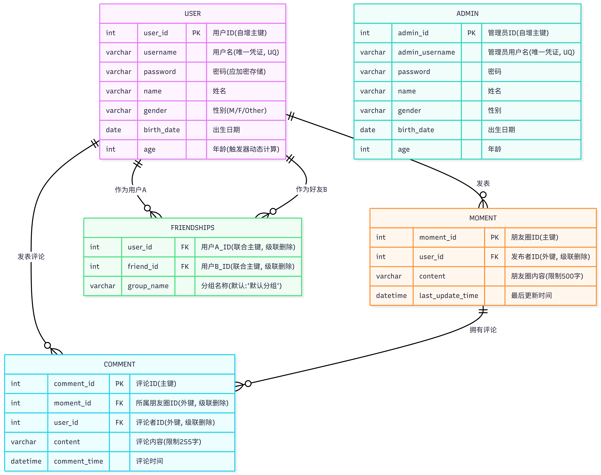

# README.md

模拟社交网络数据库。

确保已安装 Python 3.10+，然后安装项目依赖：`pip install mysql-connector-python python-dotenv`。

在项目根目录（即本 `README.md` 所在目录）创建 `.env` 文件 ：

```
DB_HOST=localhost
DB_PORT=3306
DB_USER=root
DB_PASSWORD=123456789
DB_NAME=social_network
```

并将对应的值（端口、用户名、密码）改为本地 SQL server 的数据。

确保本地 MySQL 中已存在名为 `social_network` 的数据库。可以通过`mysql -u root -p`启动 MySQL 客户端，然后执行`SHOW DATABASES;`命令检查本地数据库。如不存在`social_network`，则需要先在客户端中创建，执行命令` CREATE DATABASE social_network CHARACTER SET utf8mb4 COLLATE utf8mb4_unicode_ci; `。如果想要删除数据库，可以使用命令`DROP DATABASE social_network;`。

使用时进入`/project`，先运行一次`create_table.py`建表，然后运行`set_admin.py`初始化管理员，最后运行命令行前端`main.py`。



### 支持操作

1. 用户注册（输入用户名、密码，自动分配ID）

2. 用户登录
   1. 修改个人信息
   2. 我的朋友
      1. 查看所有用户信息
      2. 查找用户
      3. 添加朋友
      4. 查看我的朋友
      5. 删除朋友
      6. 修改朋友分组
   3. 我的帖子
      1. 发表帖子
      2. 查看我的帖子
      3. 查看我的朋友的帖子
      4. 修改我的帖子
      5. 删除我的帖子
      6. 在我或我的朋友的帖子下发表评论
   4. 用户登出
3. 管理员登录
   1. 修改个人信息
   2. 用户管理
      1. 查看所有用户信息
      2. 删除用户
   3. 帖子管理
      1. 查看所有帖子
      2. 删除帖子
   4. 管理员登出